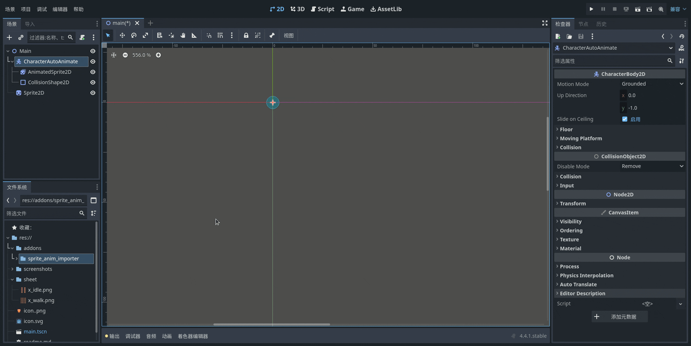

# Animated Sprite Importer

By setting up the automatic import of all animations from the sprite sheet into the AnimatedSprite2D node. Next, you can download the plugin "Animated Sprite to Animation Player Convertor 4.0" to convert animations to Player Node.

[godot library](https://godotengine.org/asset-library/asset)

## Installation

1. Search `Animated Sprite Importer` for installation in the editor - AssetLib
2. Or go directly to [web godot library](https://godotengine.org/asset-library/asset) to download the file
3. Copy `addons/sprite_ani_importer` into your own project and enable the plugin.

## Usage

1. Select the `AnimatedSprite2D` node to import the sprite animation
2. Configure the parameters and then click the import button again.
3. Note: Row ani names correspond to each row in the sprite animation table.

